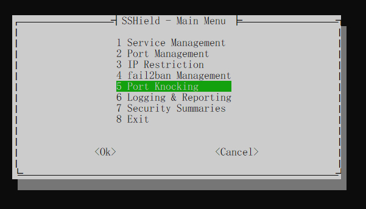

# SSHield
A Linux Server Security Tool.

SSHield is a powerful, all-in-one security tool for Linux servers, designed to protect against brute-force attacks and provide robust management of critical services.

### Screenshot


## Fast Install
```bash
curl -sSL https://raw.githubusercontent.com/dehnavi97/sshield/main/install.sh | bash
```
and run with:
```bash
sshield
```
## Full Documentation

- [English](readme_en.md)
- [Persian](readme_fa.md)
